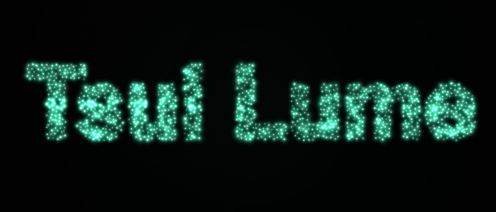

## Tsui Lume  
深い闇に漂う、光の粒。気まぐれに集まり、弾け、回り、時々文字や形に並ぶ。  
ログイン不要、インストール不要、データの外部送信無し。広告も一切無し。データ収集もしていません。  

※ 作者プロフィールや Tsui series のランディングページ等の情報ページでは、
   訪問数の把握に Cloudflare Web Analytics を利用しています
   (Cookie なし / フィンガープリントなし / クロスサイトトラッキングなし)。

## スクリーンショット  
  

## 使い方  
以下の３つの起動方法があります。  
1. [https://hajimetwi3.github.io/Tsui-Lume/](https://hajimetwi3.github.io/Tsui-Lume/)をブラウザから開く
2. [https://tsuilume.pages.dev/](https://tsuilume.pages.dev/)をブラウザから開く  
3. index.htmlをダウンロードし、ブラウザから開く  

---  
## 注意事項  
- 本サービスは現状のまま提供されており、動作の保証はありません。利用によって生じた損害について、作成者は一切の責任を負いません。自己責任でご利用ください。

---  
## 外部送信していない事の確認方法  
DevToolsのNetworkタブ等でご確認いただけますと幸いです。  

---  

## ライセンス  

- 本アプリ本体 → [MIT License](./LICENSE)  

## 作った人  

[Hajime Tsui](https://hajimetwi3.github.io/hajimetwi3/)  

---

## RELATED  

本アプリは Tsui series(静かな道具たち)の一つです。  
[https://hajimetwi3.github.io/hajimetwi3/Tsui-series/](https://hajimetwi3.github.io/hajimetwi3/Tsui-series/)  
